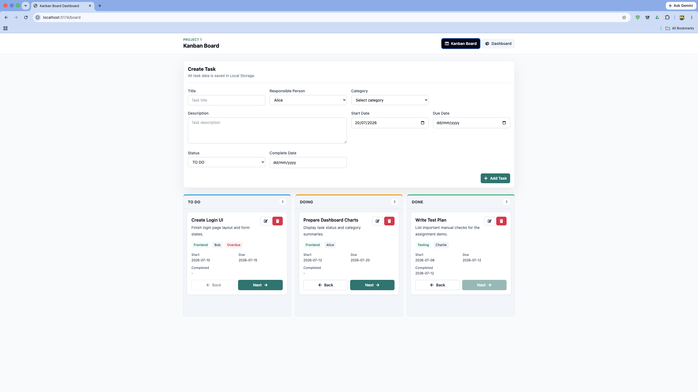
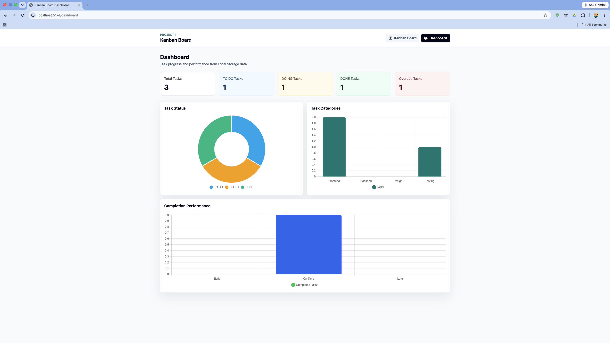

# Kanban Board with Dashboard

A React JS Kanban Board application built for Project 1. It uses Tailwind CSS for styling and Local Storage for all persistence. There is no backend, database, API, Firebase, or Supabase.

## Features

- Three-column Kanban board: TO DO, DOING, DONE
- Create, edit, delete, and move tasks
- Assign responsible people from a predefined list
- Select existing categories or create reusable new categories
- Set start date and due date
- Automatically set completion date when a task moves to DONE
- Dashboard summary cards and charts
- Data persists after refresh using Local Storage

## Tech Stack

- React JS
- React Router
- Tailwind CSS
- Chart.js with react-chartjs-2
- Local Storage

## Screenshots

### Kanban Board



### Dashboard



## Group Members

- KAUNG ZAW HEIN -
- MOE MYINT CHO -
- SHAUN LAI KYAW SAN -

## Usage

Install dependencies:

```bash
npm install
```

Run the development server:

```bash
npm run dev
```

Build for production:

```bash
npm run build
```
